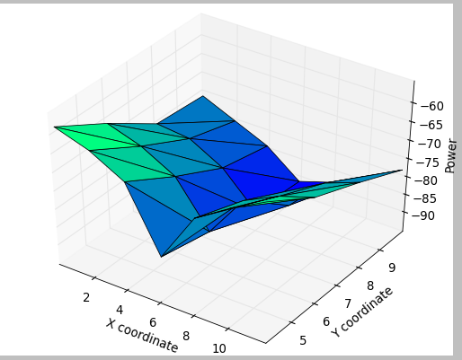

# Full-Duplex-Wireless-Communication
Modelling Single channel Full Duplex Wireless Communication  

## Passive Analog Cancellation
### Heatmap of power recepted

## Digital Active Cancellation
### Channel Estimation
  Minimum mean square error algorithm:
  Used linear predictor with adaptive filter tap coefficients
  Input signal is convolved with the estimated filter at each iteration and error is calculated
  Based on how high the error is, a gradient is computed which appropriately changes the filter tap coefficients to minimize error
  This model works for channels with delay and phase offsets giving over 60dB cancellation
  We are improving on the model to incorporate frequency offsets
  Parameters used:
    - gardient weight - 0.01
    - max iterations =1000  reducing the error to 10^(-8)  
    
  
### Configuring GNUradio
- Copy CMakeLists.txt from FHSS project(/lib and /swig) and change names appropriately
- Add local_block_paths in `/etc/gnuradio/conf.d`

### [Final GNURadio Code](Active_Cancellation/self_cancel.py)

### DSP Implementation
DSP implementation was done using DSP 5515. The Codes for the same were written in embedded C and CCSv7 IDE. Please follow the [link](Active_Cancellation/DSP_Project/main.c) for the main code. The implementation has not been *tested*. 